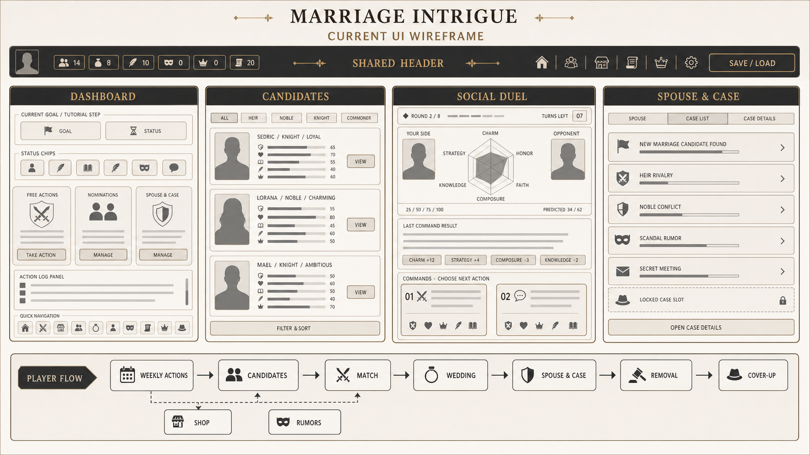

# Marriage intrigue 프로젝트 상태 보고서

기준일: 2026-07-18  
대상: Godot 프로젝트 `Marriage intrigue`  
검증 환경: Godot 4.6.3 stable, Windows, headless 실행

## 한눈에 보는 결론

현재 프로젝트는 **핵심 진행 루프를 처음부터 끝까지 실행할 수 있는 MVP 단계**다. 데이터 로딩, 주 단위 시간 진행, 자유행동, 후보 탐색, 맞선, 결혼, 배우자 관리, 제거/정치 처리, 은폐 사건, 저장/불러오기까지 연결되어 있다. 설치된 Godot 4.6.3으로 프로젝트 로딩과 8개 스모크 테스트를 다시 실행했으며 모두 통과했다.

다만 **출시 준비 완료 상태는 아니다.** 화면 로직이 `scripts/ui/Main.gd`에 많이 집중되어 있고, 세부 상호작용·중후반 밸런스·화면별 연출·CI 자동화가 남아 있다. 현재 작업 폴더에서는 Git 저장소 메타데이터도 감지되지 않아 변경 이력과 복구 체계를 먼저 마련할 필요가 있다.

| 영역 | 판정 | 근거 |
|---|---|---|
| 프로젝트 부팅/데이터 | 안정 | Godot 에디터 headless 로딩 성공, JSON 19개 로드 구조 존재 |
| 핵심 게임 루프 | MVP 완료 | 자유행동 → 후보 → 맞선 → 결혼 → 배우자 → 처리/은폐 흐름 구현 |
| 저장/상태 전이 | 안정 | 저장·슬롯·자동 저장·마이그레이션 스모크 테스트 통과 |
| UI/비주얼 | 검수 단계 | 1280×720 주요 화면과 모바일 캡처 존재, 일부 레이아웃 안정화 필요 |
| 코드 구조 | 개선 필요 | `Main.gd` 2,383줄, 132개 함수, 독립 화면 스크립트는 4개 |
| 테스트/배포 | 보강 필요 | 스모크 테스트 8개는 통과했으나 CI와 릴리즈 설정은 미구현 |
| 버전 관리 | 즉시 조치 권장 | 현재 프로젝트 경로에서 Git 저장소가 감지되지 않음 |

## 현재 구현 자산

### 코드와 데이터 규모

- GDScript: 28개
- Autoload: 5개 (`DataManager`, `GameState`, `TimeManager`, `ActionResolver`, `SaveManager`)
- 씬: 1개 (`scenes/main/Main.tscn`)
- 화면 분리 스크립트: 4개 (`Dashboard`, `FreeActions`, `Shop`, `MatchBattle`)
- JSON 데이터: 19개
- 게임용 PNG 에셋: 43개
- UI 검수 캡처: 48개
- 스모크 테스트 스크립트: 8개

### 데이터 콘텐츠

- 결혼 후보 18명
- NPC 23명
- 관계 축 9개
- 페르소나 10개
- 대사 템플릿 48개
- 자유행동 10개
- 맞선 선택 예시 5개, 맞선 관계 축 6개
- 결혼 옵션 3개, 결혼 결과 이벤트 8개
- 제거/정치 처리 방식 5개, 대응 이벤트 8개
- 은폐 행동 5개
- 작위 압박 이벤트 6개
- 튜토리얼 단계 9개

## 구현된 플레이 흐름

1. 새 게임 시작과 초기 상태 구성
2. 주 단위 자유행동과 능력치·자원·피로 변화
3. 상점 구매/장착과 행동·맞선 보정
4. 페르소나 선택, 대사 단계 성장, 주간 유지비
5. NPC 관계 및 소문 조사/유포/세탁
6. 작위·정보 품질 기반 결혼 후보 발견과 공개 정보 확장
7. 6축 맞선 전투, 후보별 선택지, 성공/실패 판정
8. 결혼식 선택, 배우자 상태와 초상화 전환
9. 배우자 제거 또는 비치명적 정치 처리
10. 사건 파일 생성, 은폐 행동, 조사/증거/소문 진행
11. 작위 압박 이벤트와 다음 작위 후보 해금
12. 30세 혼인 시장 페널티와 35세 종료 조건

## 부분 구현 및 미구현

기존 `IMPLEMENTATION_STATUS_CHECKLIST.md`의 항목 집계는 완료 178개, 부분 구현 14개, 미구현 12개다.

### 부분 구현

- 상황별 대사와 행동에 대한 페르소나 보정의 전면 적용
- 관계 축 요약 및 실제 판정 반영 범위
- 후보 정보 품질 0/90 구간의 세부 공개 단계
- 후보별 접근권과 작위 시장 제한
- 제거 성공 후 다음 후보/작위 루프 연결의 일부 구간
- 작위별 중후반 수치 밸런스
- 인물·후보·배우자·처리·은폐 화면의 스크립트 분리
- 1280×720 및 모바일 레이아웃의 전 화면 검수

### 미구현 또는 명확한 공백

- 행동별 별도 성공/실패 판정이 필요한 행동 분리
- 장기 행동 예약/취소 UI
- NPC 선물, 소문전 전용 상호작용, NPC 상세 화면
- 소문 주제 선택 후 대상 지정과 소문 위험 이벤트
- 맞선 요청 거절 및 준비 기간 손실 이벤트
- 범용 이벤트 시스템
- 릴리즈용 프로젝트 설정 정리
- CI 기반 자동 테스트

## 실행 검증 결과

2026-07-18에 다음 검증을 실제 실행했다.

| 검증 | 결과 |
|---|---|
| Godot headless 에디터 프로젝트 로딩 | 통과 |
| `SmokeStatInfluence.gd` | 통과 |
| `SmokeMatchChoiceScaling.gd` | 통과 |
| `SmokeFlowInvariants.gd` | 통과 |
| `SmokeSaveLoad.gd` | 통과 |
| `SmokeResourceHud.gd` | 통과 |
| `SmokeCalendarUi.gd` | 통과 |
| `SmokeUiFeedback.gd` | 통과 |
| `SmokeMatchBattleUi.gd` | 통과 |

실행 결과: **실패 0건 / 8개 스모크 테스트 통과 / 프로젝트 로딩 통과**

## 주요 위험

1. **UI 코드 집중**  
   `scripts/ui/Main.gd`가 2,383줄과 132개 함수로 구성되어 변경 영향 범위가 크다. 남은 화면을 독립 스크립트로 분리하고 공통 카드·필터·결과 패널을 재사용 컴포넌트로 추출하는 편이 안전하다.

2. **단일 메인 씬 의존**  
   실제 씬 파일이 `Main.tscn` 하나뿐이라 화면 단위 편집·테스트·재사용이 어렵다. 현재의 코드 생성 UI를 유지하더라도 주요 흐름별 테스트 씬 또는 조립 가능한 UI 씬을 추가할 가치가 있다.

3. **자동화 공백**  
   스모크 테스트는 존재하고 현재 모두 통과하지만 로컬 수동 실행에 의존한다. 데이터 파싱, 프로젝트 로딩, 핵심 상태 전이 테스트를 CI에서 실행해야 회귀를 빠르게 발견할 수 있다.

4. **버전 관리 부재**  
   현재 프로젝트 경로에서 Git 저장소가 감지되지 않았다. 대규모 리팩터링 전에 저장소 초기화, 첫 기준 커밋, `.godot/` 및 임시 캡처 제외 규칙을 준비하는 것이 우선이다.

5. **출시 품질 검수 미완료**  
   주요 UI 캡처는 풍부하지만 전 해상도·전 상태 조합에 대한 체계적 검수가 아니다. 모바일 좁은 폭, 긴 텍스트, 정보 잠금 단계, 실패/게임오버/사건 종결 상태를 체크리스트로 고정해야 한다.

## 권장 다음 작업 순서

1. Git 저장소와 제외 규칙을 준비하고 현재 동작 상태를 기준점으로 보존한다.
2. 인물/후보 화면과 배우자/처리/은폐 화면을 `scripts/ui/screens/`로 분리한다.
3. 8개 스모크 테스트와 JSON 파싱 검증을 한 명령으로 실행하는 CI를 구성한다.
4. 맞선 거절, 소문 대상 지정, NPC 상세·선물 등 비어 있는 상호작용을 완성한다.
5. 1280×720, 모바일, 긴 한국어 문자열 기준으로 전 화면 시각 회귀 검수를 한다.
6. 작위별 중후반 수치와 30~35세 압박 구간을 장기 플레이로 조정한다.
7. 릴리즈 프리셋, 버전 표기, 저장 데이터 호환 정책을 확정한다.

## UI 와이어프레임

현재 구현 화면과 흐름을 기준으로 생성한 최신 와이어프레임:

와이어프레임은 공통 자원 헤더와 탐색 바, 대시보드/후보/맞선/배우자·사건의 핵심 화면, 그리고 주간 진행 루프의 연결 관계를 한 장에 요약한다. 세부 구현 기준은 `UI_WIREFRAME.md`와 실제 `tmp/ui_capture_*.png` 캡처를 함께 참고한다.

## 관련 문서

- `IMPLEMENTATION_STATUS_CHECKLIST.md`: 기능별 세부 체크리스트
- `PROJECT_STRUCTURE.md`: 현재 코드 구조와 화면 분리 현황
- `PROJECT_SPEC.md`: 게임 기획 및 시스템 명세
- `UI_WIREFRAME.md`: 기존 UI 구성 설명
- `IMPLEMENTATION_BACKLOG.md`: 단계별 구현 백로그
