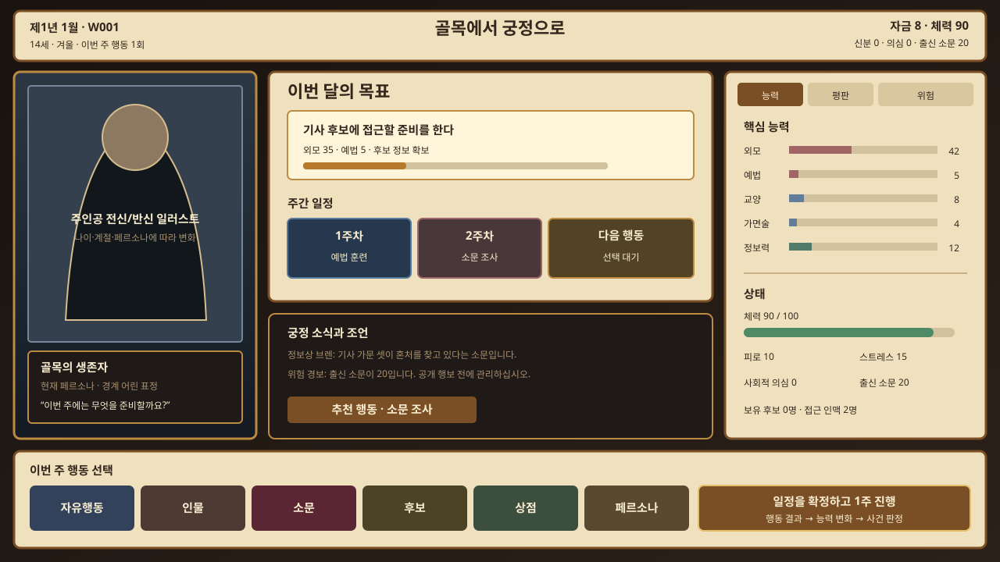
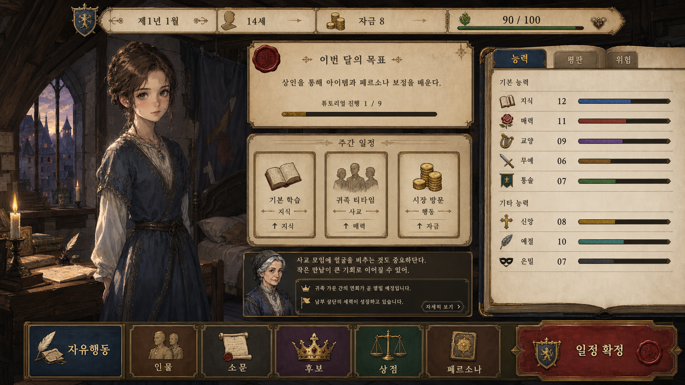
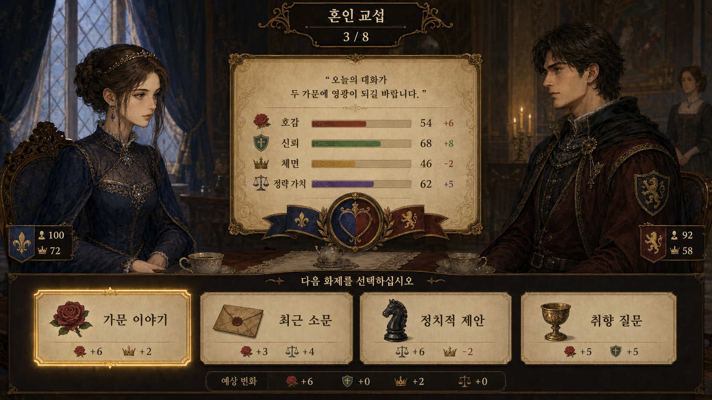

# 프린세스 메이커 계열 참고 UI 방향

## 목표

고전 육성 시뮬레이션의 장점인 **캐릭터와 함께 시간을 보낸다는 감각**, **달력 중심의 일정 운영**, **한 화면에서 확인되는 능력 성장**을 가져오되, `Marriage intrigue`의 핵심인 혼인 시장·정보전·정치 위험을 전면에 둔다. 원작 화면, 문양, 캐릭터, 고유 아이콘은 복제하지 않는다.

## 참고한 화면 문법

- 주인공 일러스트와 생활 공간을 화면의 가장 큰 시각적 초점으로 둔다.
- 날짜, 나이, 자금, 체력은 항상 같은 위치에서 즉시 읽힌다.
- 능력치는 장부/수첩처럼 묶고 탭으로 `능력`, `평판`, `위험`을 전환한다.
- 플레이어의 핵심 입력은 하단의 큰 행동 버튼과 일정 확정 버튼에 집중한다.
- 행동을 고르면 주간 일정 슬롯에 들어가고, 실행 뒤 대사·능력 변화·사건 결과를 짧은 연출로 보여준다.

## Marriage intrigue만의 차별화

- 파스텔 동화풍 대신 양피지, 짙은 남색, 포도주색, 낡은 금박을 사용한다.
- 방 배경은 성장 단계에 따라 `골목 다락방 → 소귀족 객실 → 백작가 응접실 → 궁정 개인실`로 바뀐다.
- 능력치 외에 `출신 소문`, `사회적 의심`, `배우자 경계`, `사건 증거`를 동등한 핵심 정보로 취급한다.
- 집사형 조언자 대신 정보상, 하녀, 재단사 같은 인물이 목표·경보·추천 행동을 전달한다.
- 맞선은 전투 UI가 아니라 응접실에서 진행되는 **대화 교섭전**으로 보이게 한다.

## 1280×720 대시보드 와이어프레임



레이아웃 비율:

- 상단 9%: 날짜·제목·핵심 자원
- 좌측 25%: 주인공 일러스트와 현재 페르소나/대사
- 중앙 45%: 현재 목표, 주간 일정, 궁정 소식
- 우측 26%: 능력·평판·위험 장부
- 하단 17%: 행동 카테고리와 일정 확정

## 비주얼 목표 목업

### 대시보드



- 주인공과 현재 생활 공간을 가장 큰 초점으로 두고, 성장 단계가 배경·의상 변화로 보이게 한다.
- `이번 달의 목표 → 주간 일정 → 일정 확정`을 한 번의 시선 이동으로 연결한다.
- 능력·평판·위험은 상시 노출하되 펼친 장부처럼 보여 생활 화면과 데이터 화면을 분리한다.

### 혼인 교섭



- 두 인물의 표정과 응접실 분위기를 전면에 두고 수치는 중앙 양피지 위 보조 정보로 낮춘다.
- 선택지는 아이콘, 주제, 예상 변화가 한 카드 안에서 읽히게 한다.
- 주인공은 궁정 남색, 후보는 포도주색을 사용하고 금박 강조로 현재 선택을 표시한다.

## 맞선 화면 방향

```text
┌ 날짜/장소 ─────────────── 혼인 교섭 3/8 ───── 예상 인상 ┐
│                                                          │
│ [주인공 반신]     응접실의 두 인물과 차탁      [후보 반신] │
│ 페르소나/체력      최근 대사와 반응 문장       작위/성향   │
│                                                          │
├ 관계 리본: 호감 · 흥미 · 신뢰 · 안심 · 체면 · 정략 가치 ┤
│ [선택지 1] [선택지 2] [선택지 3] [후보 전용 선택지]      │
│ 예상 변화 / 요구 능력 / 금기 경고                         │
└──────────────────────────────────────────────────────────┘
```

- 청·적 결투 프레임은 제거하고, 응접실의 두 인물과 대사에 화면을 더 할당한다.
- 6축은 레이더 하나보다 얇은 관계 리본과 핵심 2축 강조를 병행한다.
- 선택 결과마다 후보의 표정, 시선, 손동작, 배경 인물의 반응을 바꿔 수치 변화를 서사 장면으로 전달한다.

## 비주얼 토큰

| 용도 | 색상 | 의미 |
| --- | --- | --- |
| 양피지 | `#EFE1BD` | 장부, 일정, 설명 |
| 잉크 | `#33271D` | 본문과 숫자 |
| 낡은 금박 | `#BD8A42` | 프레임, 중요 정보 |
| 궁정 남색 | `#26384D` | 주인공·신뢰·정보 |
| 포도주색 | `#5A2634` | 후보·소문·위험 |
| 회복 녹색 | `#4D8A65` | 체력·안정·성공 |

## 구현 순서

1. [적용] 공통 헤더를 날짜 장부 + 자원 표시로 재배치한다.
2. [적용] 대시보드의 주인공 초상화를 크게 하고 현재 목표/주간 일정/상태 장부를 첫 화면 높이에 배치한다.
3. [적용] 자유행동을 카드 목록뿐 아니라 하단 일정 슬롯에 넣는 선택 흐름으로 바꾼다.
4. [부분 적용] 맞선 중앙을 응접실 교섭 장면으로 바꾸고 수치는 관계 리본과 보조 지표로 낮춘다. 상태별 표정 변형은 후속 에셋 작업이다.
5. 성장 단계·혼인 상태별 방 배경과 주인공 의상 변형을 추가한다.

## 이미지 생성 프롬프트 기록

- 생성 방식: Codex 내장 이미지 생성, 현재 게임 캡처를 정보 구조 참고 이미지로만 사용.
- 공통 제약: 16:9 게임 화면, 1280×720 기준 배치, 원작의 캐릭터·문양·프레임·고유 아이콘을 복제하지 않는 독자 디자인, 비성적 인물 표현, 워터마크 없음.
- 대시보드 프롬프트 핵심: `낡은 다락방의 주인공을 좌측 최대 초점으로 배치하고, 상단 날짜/나이/자금 장부, 중앙 목표와 3칸 주간 일정, 우측 능력·평판·위험 장부, 하단 대형 행동 리본을 갖춘 중세 정치 육성 시뮬레이션 UI`.
- 혼인 교섭 프롬프트 핵심: `촛불이 켜진 응접실의 두 인물을 좌우에 배치하고, 중앙 대사와 호감·신뢰·체면·정략 가치 리본, 하단 네 개의 대화 선택 카드를 갖춘 인물 중심 혼인 협상 UI`.
- 생성 원본 크기: 두 이미지 모두 1672×941. 실제 Godot 구현은 기준 뷰포트 1280×720에서 UI를 재구성하며 목업 자체를 통째로 배경 이미지로 사용하지 않는다.
